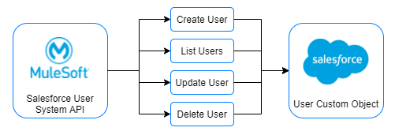
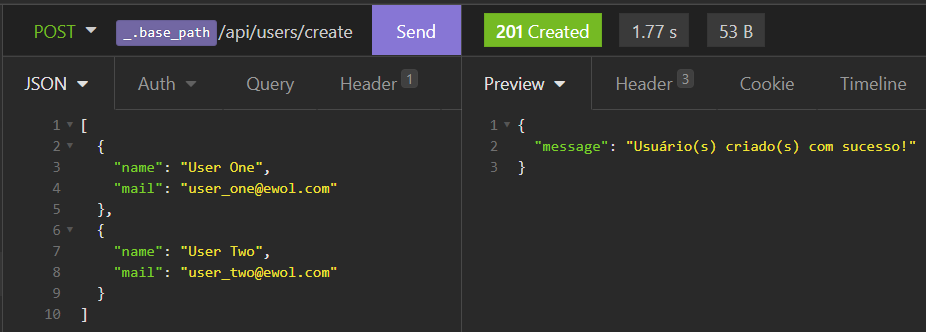
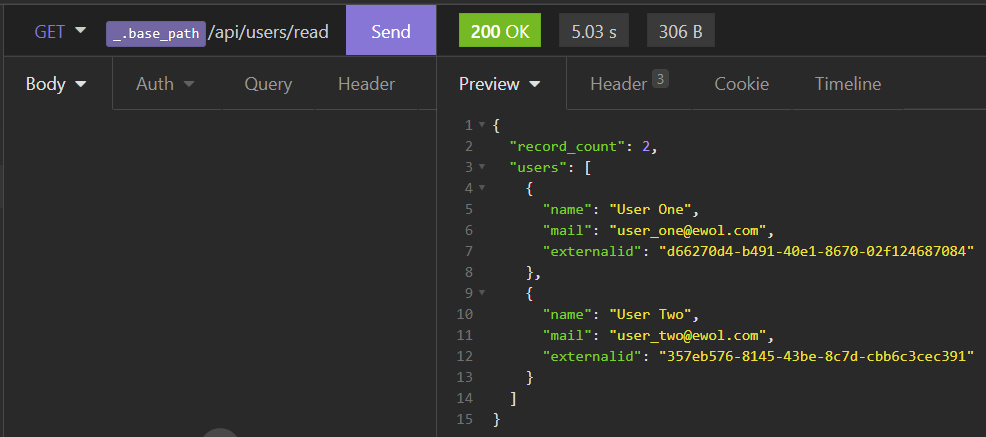
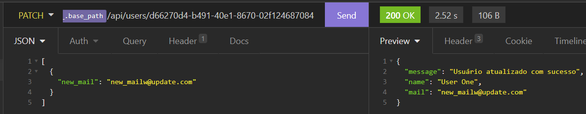
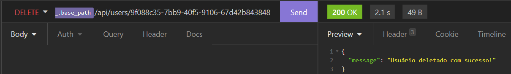

# User CRUD (MuleSoft and Salesforce Integration)
This project contains a simple implementation of a REST API built on MuleSoft, which communicates with Salesforce. The API has the complete CRUD for a Custom Salesforce Object that represents users.

## Overview 🔍

### Salesforce ☁️

<p align="center">
  
</p>

<div style='text-align: justify;'>
Salesforce is a technology that provides customer relationship management (CRM) service and also provides a complementary suite of enterprise applications focused on customer service, marketing automation, analytics, and application development.
</div>

<a href="https://www.salesforce.com/">See more.</a>


### MuleSoft 🔗

<p align="center">
  
</p>

<div style='text-align: justify;'>
MuleSoft is a technology that provides integration software for connecting applications, data and devices, designed to integrate software as a service (SaaS), on-premises software, legacy systems and other platforms.
</div>

<a href="https://www.mulesoft.com/">See more.</a>

## Specifics :computer:

### Application Architecture 🧰

<p align="center">
  
</p>

<div style='text-align: justify;'>
API-led connectivity is a methodical way to connect data to applications through reusable and purposeful APIs. These APIs are developed to play a specific role – unlocking data from systems, composing data into processes, or delivering an experience. The APIs used in an API-led approach to connectivity fall into three categories:
</div>

<br>

- <strong>System APIs:</strong> access the core systems of record.
- <strong>Process APIs:</strong> interact with and shape data within a single system or across systems.
- <strong>Experience APIs:</strong> data can be reconfigured so that it is most easily consumed by its intended audience.

Here we have only the System level, which access Salesforce record data using four HTTP operations: POST (create), GET (list), PATCH (update), DELETE.

### Operations :wrench:

<strong>Create Users:</strong> to create a user, you'll need to send a JSON Array, in which each object contains a 'name' and 'mail' strings. The API will automatically generate a <a href="https://docs.mulesoft.com/mule-runtime/4.3/dw-core-functions-uuid">UUID(v4)</a> for user's external id, sending the information to Salesforce.
```json
[
  { "name": "User One", "mail": "user_one@mail.com" },
  { "name": "User Two", "mail": "user_two@mail.com" },
  ...
]
```


<p align="center">
  
</p>

<br>

<strong>Get Users:</strong> there's no need to sent data to list all Salesforce Organization's custom users registered.


<p align="center">
  
</p>

<br>

<strong>Update User:</strong> to update a user, you'll need to send a JSON Array with one object containing a 'new_mail' string (if you send more than one, the API will consider the 0 index, ignoring all other records), also passing the user external id as a URI parameter. As the name cannot change, the only record attribute that cand be updated is the user e-mail.
```json
[
  { "new_mail": "new_mailw@update.com" }
]
```

<p align="center">
  
</p>

<br>

<strong>Delete User:</strong> to delete a single user, his external id need to be passed as a URI parameter.

<p align="center">
  
</p>

<br>

### Objects :cd:

### Mule Flows :twisted_rightwards_arrows:

### Security :key:

MuleSoft has it's own way of encrypting data: the <a href="https://docs.mulesoft.com/mule-runtime/4.3/secure-configuration-properties">Secure Properties Connector</a>. Through a secure encryption key (which I obviously deleted), developers can set sensible information to it's encripted mode.
